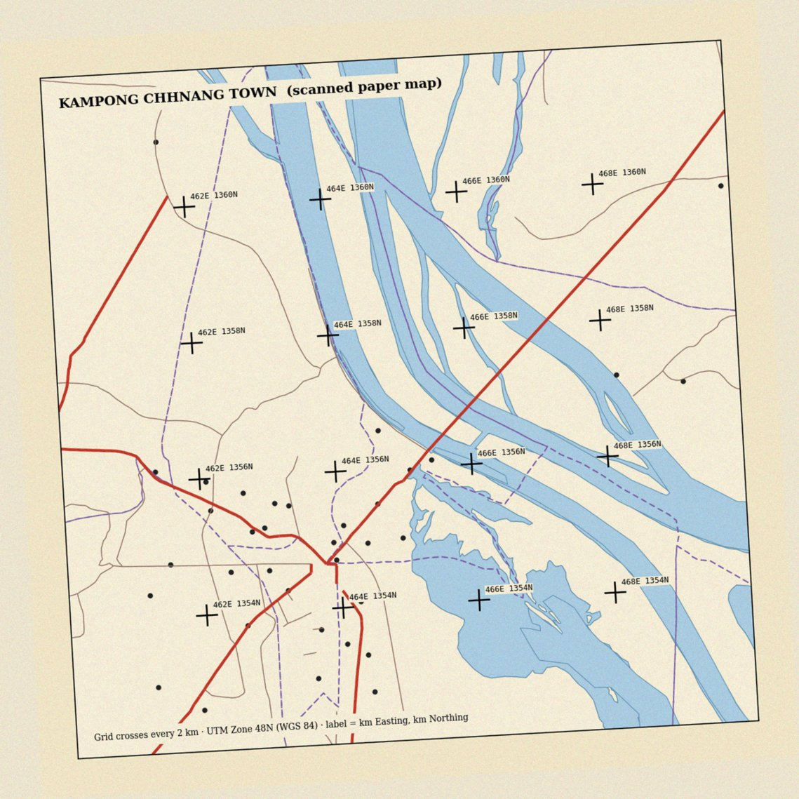

# មេរៀនទី៧៖ ការបំប្លែងទៅឌីជីថល និង Georeferencing

!!! info "ព័ត៌មានមេរៀន"
    **រយៈពេលបង្រៀនដែលស្នើ៖ ៣ ម៉ោង** · មេរៀនទី ៧ ក្នុងចំណោម ១៥

[:material-presentation-play: ស្លាយបង្រៀនមេរៀននេះ](../slides/lesson-07.html){ .md-button target="_blank" }

ព័ត៌មានភូមិសាស្ត្រដ៏មានតម្លៃជាច្រើននៅកម្ពុជា នៅតែស្ថិតលើក្រដាស៖ ផែនទីសុរិយោដីចាស់ ប្លង់ក្រុង ផែនទីប្រព័ន្ធធារាសាស្ត្រ។ ក្រៅពីនេះ វត្ថុជាច្រើនមើលឃើញលើរូបភាពផ្កាយរណប ប៉ុន្តែមិនទាន់មានជាស្រទាប់វ៉ិចទ័រ។

មេរៀននេះបង្រៀនដំណើរការពីរ៖ **Georeferencing** ដែលផ្ដល់ទីតាំងពិតដល់រូបភាពដែលគ្មាន CRS និង **ការបំប្លែងទៅឌីជីថល (Digitizing)** ដែលគូររូបរាងពីរូបភាពទៅជាវ៉ិចទ័រ។

---

## ៧.១. គោលបំណងសិក្សា

បន្ទាប់ពីបញ្ចប់មេរៀន និស្សិតអាច៖

1. ពន្យល់គោលបំណង និងជំហាននៃ Georeferencing។
2. ជ្រើស និងចែកចាយចំណុចបញ្ជា (GCP) ឲ្យបានល្អ។
3. បែងចែកការបំប្លែង Polynomial 1 2 3 និងចំនួន GCP អប្បបរមា។
4. បកស្រាយកំហុស RMS និងពន្យល់ហេតុអ្វីត្រូវមានចំណុចពិនិត្យ។
5. ពន្យល់ក្បួនការគូសវ៉ិចទ័រ៖ មាត្រដ្ឋាន ចំណុចកំពូល Snapping និងឋានលេខា។

### ចំណេះដឹងមុនត្រូវមាន

- ខ្លឹមសារ[មេរៀនទី២](lesson-02.md)៖ ធរណីមាត្រ និងកំហុសឋានលេខា។
- ខ្លឹមសារ[មេរៀនទី៦](lesson-06.md)៖ ភាពត្រឹមត្រូវ និងកំហុសលម្អៀង។
- CRS និង UTM (សៀវភៅទី១)។

---

## ៧.២. ស្ថានភាពបើកមេរៀន៖ ផែនទីក្រដាសចាស់របស់ក្រុងកំពង់ឆ្នាំង

ការិយាល័យស្រុកមានផែនទីក្រដាសចាស់ដែលបង្ហាញផ្លូវ និងទន្លេរបស់ក្រុងកំពង់ឆ្នាំង។ គេស្កេនវាជាឯកសារ JPG។ ពេលបើកក្នុង QGIS រូបភាពលេចឡើងនៅកូអរដោនេ (០, ០) ឆ្ងាយពីកម្ពុជា ហើយវាក៏រៀងបន្តិចដែរ ព្រោះក្រដាសមិនដាក់ត្រង់ពេលស្កេន។

ផែនទីនោះមានសញ្ញាបូក (+) នៃក្រឡាកូអរដោនេ UTM រៀងរាល់ ២ គីឡូម៉ែត្រ។ តើយើងប្រើសញ្ញាទាំងនោះដើម្បីដាក់រូបភាពឲ្យត្រូវទីតាំងបានដូចម្ដេច?

សំណួរដែលមេរៀននេះឆ្លើយ៖

- តើត្រូវជ្រើសចំណុចបញ្ជាប៉ុន្មាន និងនៅកន្លែងណា?
- តើការបំប្លែងប្រភេទណាសមស្រប?
- ពេល QGIS បង្ហាញ RMS = ២,៣ តើយើងទុកចិត្តលទ្ធផលបានឬទេ?

---

## ៧.៣. ទ្រឹស្ដីស្នូល

### ៧.៣.១. Georeferencing ជាអ្វី

**Georeferencing** គឺជាការកំណត់ទំនាក់ទំនងរវាងកូអរដោនេរូបភាព (ជួរឈរ ជួរដេក ជាភីកសែល) និងកូអរដោនេពិភពពិត (ឧ. Easting Northing ក្នុង EPSG:32648)។

ដំណើរការ៖

1. រកចំណុចដែលស្គាល់ទីតាំងទាំងក្នុងរូបភាព និងលើដី ហៅថា **ចំណុចបញ្ជា (Ground Control Point, GCP)**។
2. សម្រាប់ GCP នីមួយៗ កត់ត្រា (ភីកសែល X Y) ↔ (Easting Northing)។
3. គណនាសមីការបំប្លែងពី GCP ទាំងអស់។
4. អនុវត្តសមីការលើភីកសែលទាំងអស់ ហើយបង្កើតរ៉ាស្ទ័រថ្មីដែលមាន CRS (resampling)។

ប្រភព GCP ល្អ៖ ក្រឡាកូអរដោនេដែលបោះពុម្ពលើផែនទី (ល្អបំផុត) · ចំណុចប្រសព្វផ្លូវ ស្ពាន ជ្រុងអគារ ដែលមិនប្ដូរតាំងពីផែនទីត្រូវបានធ្វើ · ចំណុចវាស់ដោយ GNSS។ ជៀសវាង៖ ខ្សែទឹកទន្លេ (ប្ដូររៀងរាល់ឆ្នាំ) ដើមឈើ និងព្រំស្រែ។

<figure markdown>
--8<-- "assets/svg/l07-georef.svg"
<figcaption>រូបទី៧.១៖ Georeferencing៖ ចំណុចបញ្ជា (GCP) ភ្ជាប់ទីតាំងក្នុងរូបភាព ទៅកូអរដោនេពិភពពិត ដើម្បីគណនាសមីការបំប្លែង។</figcaption>
</figure>

### ៧.៣.២. ការបំប្លែង និង GCP អប្បបរមា

| ការបំប្លែង | អ្វីដែលវាកែបាន | GCP អប្បបរមា | ពេលប្រើ |
|---|---|---:|---|
| Helmert | រំកិល បង្វិល មាត្រដ្ឋានតែមួយ | ២ | រូបភាពមិនរៀង |
| **Polynomial 1 (Affine)** | ខាងលើ + មាត្រដ្ឋាន X Y ខុសគ្នា + រៀងទ្រេត | **៣** | ផែនទីស្កេន ភាគច្រើន |
| Polynomial 2 | ខាងលើ + ការរៀងកោង | **៦** | ក្រដាសរួញ ផែនទីចាស់ខូច |
| Polynomial 3 | ការរៀងកោងស្មុគស្មាញ | ១០ | កម្រប្រើ |
| Thin plate spline | បង្ខំឲ្យត្រូវ GCP គ្រប់ចំណុច | ច្រើន | ផែនទីរៀងមិនទៀងទាត់ |

ក្បួនជាក់ស្ដែង៖ **ចាប់ផ្ដើមដោយ Polynomial 1** ជាមួយ GCP ៨ ទៅ ១២ ដែលរាយពេញផែនទី។ ប្ដូរទៅ Polynomial 2 លុះត្រាតែមានភស្តុតាងថាផែនទីរៀងកោង ហើយមាន GCP គ្រប់គ្រាន់។

ការចែកចាយ GCP សំខាន់ដូចចំនួនដែរ។ GCP ដែលប្រមូលផ្ដុំនៅកណ្ដាល ធ្វើឲ្យជ្រុងផែនទីខុសខ្លាំង ទោះ RMS ទាបក៏ដោយ។

<figure markdown>
--8<-- "assets/svg/l07-gcp-spread.svg"
<figcaption>រូបទី៧.២៖ ចំនួន GCP ដូចគ្នា (៨) ប៉ុន្តែការចែកចាយខុសគ្នា។ GCP ដែលប្រមូលផ្ដុំ ធ្វើឲ្យតំបន់ឆ្ងាយ ជាពិសេសជ្រុងផ្ទុយ មានកំហុសធំ ទោះ RMS ទាបក៏ដោយ។</figcaption>
</figure>

### ៧.៣.៣. កំហុស RMS និងចំណុចពិនិត្យ

ក្រោយគណនាសមីការ GCP នីមួយៗមាន **កំហុសសំណល់ (Residual)** គឺចម្ងាយរវាងទីតាំងដែលអ្នកបញ្ចូល និងទីតាំងដែលសមីការព្យាករ។ **RMS error** ជាឫសការ៉េនៃមធ្យមការ៉េកំហុសទាំងនោះ។

- RMS ធំ ព្រោះ GCP មួយមានកំហុសធំ → ពិនិត្យ ហើយចុចម្ដងទៀត ឬលុប GCP នោះ។
- RMS ទាប **មិនធានា** ថាផែនទីត្រឹមត្រូវទេ។ ជាមួយ GCP ស្មើចំនួនអប្បបរមា RMS = ០ ជានិច្ច ព្រោះសមីការឆ្លងកាត់ចំណុចទាំងអស់។

ដើម្បីដឹងកំហុសពិត ត្រូវទុក GCP ខ្លះ **មិនប្រើក្នុងការគណនា** ហៅថា **ចំណុចពិនិត្យ (Check points)** ហើយវាស់កំហុសលើចំណុចទាំងនោះ។

!!! example "ពិសោធន៍៖ ចំណុចបញ្ជា និង RMS"
    GCP មួយត្រូវបានចុចខុសទីតាំង។ រកវាពីតារាងកំហុស បិទវា ហើយប្រៀបធៀប RMS។ បន្ទាប់មក ប្ដូរទៅ Polynomial ២ ជាមួយ GCP តែ ៦ ហើយមើលកំហុសលើចំណុចពិនិត្យ។

### ៧.៣.៤. ការគូសវ៉ិចទ័រ (Digitizing)

**Digitizing** គឺជាការគូរវត្ថុលើរូបភាព (ផែនទី georeferenced ឬរូបភាពផ្កាយរណប) ដើម្បីបង្កើតស្រទាប់វ៉ិចទ័រ។

ក្បួនសំខាន់៖

- **កំណត់មាត្រដ្ឋានគូរ** មុនចាប់ផ្ដើម ហើយគូរនៅមាត្រដ្ឋាននោះជានិច្ច (ឧ. ១:៥ ០០០)។ ពង្រីកខ្លាំងពេក ធ្វើឲ្យគូរតាមភីកសែលរំខាន។ បង្រួមពេក ធ្វើឲ្យបាត់ព័ត៌មាន។
- **ចំណុចកំពូល** ដាក់នៅពេលរូបរាងប្ដូរទិស មិនមែនរៀងរាល់ ២ ម៉ែត្រទេ។
- **Snapping** ធ្វើឲ្យចុងបន្ទាត់ និងព្រំពហុកោណជាប់គ្នាពិតប្រាកដ ដើម្បីជៀសវាងកំហុស undershoot overshoot និងចន្លោះស្ដើង (sliver) ក្នុង[មេរៀនទី២](lesson-02.md)។
- **Avoid overlap** សម្រាប់ពហុកោណជាប់គ្នា (ក្បាលដី ឃុំ)។
- **បំពេញគុណលក្ខណៈភ្លាមៗ** ពេលគូររួច ដោយប្រើទម្រង់ ([មេរៀនទី៦](lesson-06.md))។

!!! example "ពិសោធន៍៖ ចំនួនចំណុចកំពូល"
    បង្កើនកម្រិតអត់ធ្មត់ ហើយសង្កេតចំនួនចំណុច និងប្រវែងស្ទឹង។ តើចំណុចប៉ុន្មានភាគរយដែលអាចលុបបាន ដោយរូបរាងស្ទើរមិនប្ដូរ?

ពេលគូរតិចពេក ស្ទឹងខ្លីជាងពិត ហើយកោងតូចៗបាត់។ ពេលគូរច្រើនពេក ឯកសារធំ ហើយកំហុសដៃរបស់អ្នកគូរក្លាយជា «ព័ត៌មាន» ក្លែងក្លាយ។

### ៧.៣.៥. ដែនកំណត់នៃទិន្នន័យដែលគូរពីផែនទីចាស់

ស្រទាប់ដែលគូររួច ទទួលមរតកកំហុសទាំងអស់ពីប្រភព៖

**កំហុសសរុប ≈ កំហុសផែនទីដើម + កំហុសស្កេន/Georeferencing + កំហុសគូរ**

ផែនទីមាត្រដ្ឋាន ១:៥០ ០០០ ដែលគូសដោយដៃ មានភាពត្រឹមត្រូវប្រហែល ០,៥ មម លើក្រដាស ស្មើ **២៥ ម** លើដី។ ទោះ Georeferencing ល្អឥតខ្ចោះ ក៏ស្រទាប់ដែលគូរមិនអាចត្រឹមត្រូវជាង ២៥ ម បានដែរ។

ត្រូវកត់ត្រានៅក្នុងមេតាទិន្នន័យ៖ ផែនទីប្រភព មាត្រដ្ឋាន ឆ្នាំ ចំនួន GCP ប្រភេទការបំប្លែង RMS និងមាត្រដ្ឋានគូរ។

---

## ៧.៤. ឧទាហរណ៍ដែលបានដោះស្រាយ៖ Georeference ផែនទីក្រុងកំពង់ឆ្នាំង

ផែនទីស្កេនមានសញ្ញាបូក ១៦ (៤ × ៤) រៀងរាល់ ២ គម ក្នុង UTM 48N។ ១ ភីកសែលស្មើប្រហែល ១០ ម លើដី។ (ផែនទីនេះប្រើក្នុង [លំហាត់ទី៧](../workbook/lab-07.md))។

<figure markdown>
{ loading=lazy }
<figcaption>រូបទី៧.៣៖ ផែនទីស្កេនក្រុងកំពង់ឆ្នាំងដែលប្រើក្នុងលំហាត់ទី៧។ រូបភាពរៀង ៣,២° ហើយមានសញ្ញាបូក ១៦ នៃក្រឡា UTM រៀងរាល់ ២ គម ដែលអាចប្រើជា GCP។</figcaption>
</figure>

### ជំហានទី១៖ ជ្រើស GCP

ប្រើសញ្ញាបូក ៩ ដែលរាយពេញផែនទី៖ ជ្រុងទាំងបួន ពាក់កណ្ដាលគែមទាំងបួន និងកណ្ដាល។ ទុក ៣ ទៀតជាចំណុចពិនិត្យ។ សញ្ញា `464E 1356N` ត្រូវបញ្ចូលជា X = 464000 · Y = 1356000។

### ជំហានទី២៖ ជ្រើសការបំប្លែង

ផែនទីត្រូវបានបង្វិលពេលស្កេន ប៉ុន្តែក្រដាសមិនរួញ។ Polynomial 1 ត្រូវការ GCP ៣ ហើយយើងមាន ៩ ដែលផ្ដល់ «កម្រិតសេរីភាព» គ្រប់គ្រាន់សម្រាប់រកកំហុស។

### ជំហានទី៣៖ អាន RMS

ឧបមាថា RMS = ២,៣ ភីកសែល ហើយ GCP មួយមានកំហុស ៦ ភីកសែល ខណៈផ្សេងទៀតតិចជាង ១។ GCP នោះទំនងជាចុចខុស។ ក្រោយចុចម្ដងទៀត RMS ធ្លាក់មក ០,៦ ភីកសែល (ប្រហែល ៦ ម)។

### ជំហានទី៤៖ ពិនិត្យដោយចំណុចពិនិត្យ

វាស់កំហុសលើចំណុចពិនិត្យទាំង ៣៖ ៥ ម · ៨ ម · ៧ ម។ ប្រហាក់ប្រហែល RMS ដូច្នេះការបំប្លែងមិន overfit ទេ។ ត្រួត `Kh_Lake_n_Mekong` ពីលើ ដើម្បីពិនិត្យដោយភ្នែកផងដែរ។

### សេចក្ដីសន្និដ្ឋានដែលសមស្រប

> «ផែនទីស្កេនត្រូវបាន Georeference ដោយ Polynomial 1 និង GCP ៩ ជាមួយ RMS ប្រហែល ០,៦ ភីកសែល (≈ ៦ ម) និងកំហុសលើចំណុចពិនិត្យ ៥ ទៅ ៨ ម។ ស្រទាប់ដែលគូរពីវា សមស្របសម្រាប់ផែនទីមាត្រដ្ឋានក្រុង មិនមែនសម្រាប់វាស់ព្រំក្បាលដីទេ។»

!!! warning "អ្វីដែលយើងមិនអាចសន្និដ្ឋាន"
    យើងមិនអាចសន្និដ្ឋានថាផ្លូវដែលគូរត្រឹមត្រូវ ៦ ម ទេ។ RMS វាស់តែភាពស៊ីគ្នារវាងរូបភាព និងក្រឡាកូអរដោនេ។ វាមិនវាស់ថាអ្នកធ្វើផែនទីដើម គូសផ្លូវត្រឹមត្រូវប៉ុណ្ណា ឬផ្លូវបានប្ដូរទីតាំងតាំងពីពេលនោះទេ។

---

## ៧.៥. សកម្មភាពអនុវត្ត

!!! tip "លំហាត់នេះស្ថិតក្នុងសៀវភៅអនុវត្ត"
    ការអនុវត្តលើ QGIS សម្រាប់មេរៀននេះស្ថិតក្នុង [**លំហាត់ទី៧**](../workbook/lab-07.md)។

    និស្សិតធ្វើលំហាត់នេះ **ដោយខ្លួនឯង** នៅក្រៅម៉ោងរៀន។

---

## ៧.៦. ការយល់ច្រឡំដែលត្រូវប្រុងប្រយ័ត្ន

**១. «RMS កាន់តែទាប កាន់តែល្អ ជានិច្ច»**
RMS = ០ ជាមួយ GCP អប្បបរមា មិនមានន័យថាត្រឹមត្រូវទេ។ ត្រូវមើលកំហុសលើចំណុចពិនិត្យ។

**២. «Polynomial ខ្ពស់ តែងល្អជាង»**
Polynomial ខ្ពស់ពត់រូបភាពឲ្យត្រូវ GCP ប៉ុន្តែអាចបង្ខូចតំបន់ដែលគ្មាន GCP ជាពិសេសជ្រុង។

**៣. «GCP ច្រើន គឺគ្រប់គ្រាន់»**
GCP ២០ ដែលប្រមូលផ្ដុំនៅកណ្ដាលក្រុង អាក្រក់ជាង GCP ៨ ដែលរាយពេញផែនទី។

**៤. «ទន្លេជា GCP ល្អ ព្រោះមើលឃើញច្បាស់»**
ខ្សែទឹក និងកោះប្ដូររៀងរាល់ឆ្នាំ។ ប្រើក្រឡាកូអរដោនេ ស្ពាន ចំណុចប្រសព្វផ្លូវ។

**៥. «ទិន្នន័យដែលគូរពីផែនទីចាស់ ត្រឹមត្រូវដូចការវាស់ថ្មី»**
កំហុសផែនទីដើម ស្កេន Georeferencing និងការគូរ បូកបញ្ចូលគ្នា។ ផែនទី ១:៥០ ០០០ មានកំហុសប្រហែល ២៥ ម មុនអ្នកចាប់ផ្ដើម។

---

## ៧.៧. សេចក្ដីសង្ខេបមេរៀន

Georeferencing ភ្ជាប់កូអរដោនេរូបភាពទៅកូអរដោនេពិភពពិតតាមរយៈ GCP។ Polynomial 1 ត្រូវការ GCP យ៉ាងតិច ៣ ហើយសមស្របសម្រាប់ផែនទីស្កេនភាគច្រើន។ GCP ត្រូវរាយពេញផែនទី ហើយត្រូវមានចំណុចពិនិត្យ ព្រោះ RMS ទាបមិនធានាភាពត្រឹមត្រូវ។

Digitizing បង្កើតវ៉ិចទ័រពីរូបភាព ដោយប្រើមាត្រដ្ឋានថេរ Snapping និងទម្រង់គុណលក្ខណៈ។ ភាពត្រឹមត្រូវនៃលទ្ធផលមិនអាចល្អជាងផែនទីប្រភពទេ។

!!! abstract "គំនិតស្នូលនៃមេរៀន"
    Georeferencing មិនធ្វើឲ្យផែនទីចាស់ «ត្រឹមត្រូវ» ទេ។ វាគ្រាន់តែដាក់ផែនទីនោះនៅកន្លែងត្រឹមត្រូវ ជាមួយកំហុសទាំងអស់ដែលវាមាន។

---

## ៧.៨. ពាក្យគន្លឹះខ្មែរ–អង់គ្លេស

| ពាក្យខ្មែរ | ពាក្យអង់គ្លេស | អត្ថន័យខ្លី |
|---|---|---|
| ការកំណត់ទីតាំងរូបភាព | Georeferencing | ភ្ជាប់រូបភាពទៅ CRS |
| ចំណុចបញ្ជា | Ground Control Point (GCP) | ចំណុចស្គាល់ទីតាំងទាំងពីរ |
| ការបំប្លែង | Transformation | សមីការពីភីកសែលទៅកូអរដោនេ |
| កំហុសសំណល់ | Residual | កំហុសនៃ GCP មួយ |
| កំហុស RMS | RMS error | កំហុសមធ្យមនៃ GCP ទាំងអស់ |
| ចំណុចពិនិត្យ | Check point | GCP មិនប្រើគណនា សម្រាប់វាស់កំហុស |
| ការគូសវ៉ិចទ័រ | Digitizing | គូររូបរាងពីរូបភាព |
| ការចាប់ជាប់ | Snapping | ធ្វើឲ្យចំណុចជាប់គ្នាពិតប្រាកដ |
| ការគណនាក្រឡាឡើងវិញ | Resampling | បង្កើតរ៉ាស្ទ័រថ្មីក្រោយបំប្លែង |

---

## ៧.៩. សំណួររំលឹក និងវាយតម្លៃ

### ក. សំណួរយល់ដឹង

1. ពន្យល់ Georeferencing ជាបួនជំហាន។
2. ហេតុអ្វីក្រឡាកូអរដោនេជា GCP ល្អជាងខ្សែទឹកទន្លេ?
3. Polynomial 1 និង 2 ត្រូវការ GCP អប្បបរមាប៉ុន្មាន ហើយហេតុអ្វីមិនគួរប្រើតែចំនួនអប្បបរមា?
4. ពន្យល់ថាហេតុអ្វី RMS = ០ អាចជាសញ្ញាអាក្រក់។
5. ក្បួនបីសម្រាប់ Digitizing ដែលកាត់បន្ថយកំហុសឋានលេខា។

### ខ. សំណួរអនុវត្តគោលគំនិត

6. ផែនទីក្រដាស ១:២៥ ០០០ មានកំហុសគូស ០,៥ មម។ គណនាកំហុសលើដី។ Georeferencing RMS ៣ ម បន្ថែមលើនោះ តើកំហុសសរុបប្រហែលប៉ុន្មាន?
7. អ្នកមាន GCP ១០ ប៉ុន្តែ ៨ នៅជ្រុងខាងលើឆ្វេង។ ពិពណ៌នាផលប៉ះពាល់ និងវិធីកែ។
8. តារាង GCP មួយមានកំហុស ០,៤ ០,៦ ០,៥ ៧,២ ០,៣ ភីកសែល។ តើត្រូវធ្វើអ្វី?
9. សម្រាប់រូបថតអាកាសចាស់ឆ្នាំ ១៩៦០ នៃភ្នំពេញ ដែលគ្មានក្រឡាកូអរដោនេ តើអ្នកនឹងរក GCP ពីណា?
10. ក្រុមពីរគូរស្ទឹងដដែល៖ ក្រុម ក មាន ២០០ ចំណុច ក្រុម ខ មាន ២ ០០០ ចំណុច។ ប្រវែងខុសគ្នា ៨%។ ពន្យល់មូលហេតុ ហើយស្នើមាត្រដ្ឋានគូររួម។

### គ. កិច្ចការខ្លី

រកផែនទីក្រដាស ឬរូបភាពផែនទីចាស់មួយនៃតំបន់ដែលអ្នកស្គាល់ (ផែនទីក្នុងសៀវភៅ ប្លង់សាលា ផែនទីស្រុក)។ សរសេរមួយទំព័រ៖ ចំណុចណាខ្លះអាចជា GCP និងហេតុផល · ការបំប្លែងដែលអ្នកនឹងជ្រើស · ភាពត្រឹមត្រូវដែលអ្នករំពឹងពីមាត្រដ្ឋានផែនទី · វត្ថុអ្វីខ្លះដែលមានតម្លៃក្នុងការគូរជាវ៉ិចទ័រ។

---

## កំណត់សម្គាល់សម្រាប់គ្រូបង្រៀន

### ក. ការបែងចែកពេលវេលា ១៨០ នាទី

| សកម្មភាព | ពេលវេលា |
|---|---:|
| ស្ថានភាពបើកមេរៀន៖ ផែនទីក្រដាស | ១៥ នាទី |
| Georeferencing និង GCP | ៣០ នាទី |
| ការបំប្លែង | ២៥ នាទី |
| RMS ចំណុចពិនិត្យ និងពិសោធន៍ | ៣៥ នាទី |
| Digitizing និងពិសោធន៍ចំណុចកំពូល | ៣៥ នាទី |
| ដែនកំណត់ និងឧទាហរណ៍ក្រុងកំពង់ឆ្នាំង | ៣៥ នាទី |
| សង្ខេប និងណែនាំលំហាត់ | ៥ នាទី |
| **សរុប** | **១៨០ នាទី / ៣ ម៉ោង** |

### ខ. ការភ្ជាប់ទៅមេរៀនបន្ទាប់

យើងបានឃើញកំហុសច្រើនប្រភេទរួចមកហើយ៖ លេខ ០ ដែលបាត់ ការភ្ជាប់ដែលបរាជ័យ GPS លម្អៀង និង RMS។ ដល់ពេលរៀបចំពួកវាឲ្យជាប្រព័ន្ធ៖

> «តើយើងវាស់ និងរាយការណ៍គុណភាពទិន្នន័យដោយរបៀបណា ឲ្យអ្នកប្រើដឹងថាអាចទុកចិត្តបានប៉ុណ្ណា?»

សំណួរនេះនាំទៅ [**មេរៀនទី៨៖ គុណភាពទិន្នន័យ កំហុស និងមេតាទិន្នន័យ**](lesson-08.md)។

⬅️ [មេរៀនទី៦](lesson-06.md) · ➡️ [មេរៀនទី៨](lesson-08.md)
